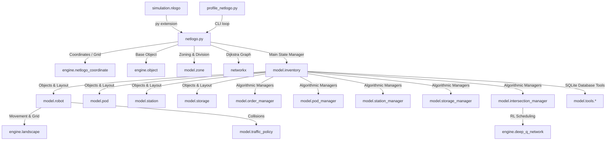

# Rika RMFS Current Architecture Map

This document outlines the software architecture, execution path, import dependencies, file flows, and organizational ownership areas of the `joint-rmfs` simulation repository.

Phase 4 split the NetLogo bridge: root `netlogo.py` is now a compatibility shim delegating to `src/rmfs/app/netlogo_api.py`. The active simulation still runs through `simulation.nlogo`, `engine/**`, and active `model/**` files.

---

## 1. Summary of Current Architecture

The simulation operates as a **hybrid NetLogo/Python agent-based model**.
* **NetLogo (`simulation.nlogo`)** acts as the frontend graphical UI, drawing the warehouse grid and animating the robots (turtles) and station layouts.
* **Python (`netlogo.py` / `model/` / `engine/`)** serves as the simulation core. It calculates robot pathing, resolves collision conflicts, schedules batch orders, matches pods to picker stations, and computes energy metrics.
* **Communication Bridge**: NetLogo uses its standard `py` extension to load `netlogo.py`, call `setup()` to initialize the state, and call `tick()` at every step.
* **State Persistability**: The entire Python simulation state is stored in an `Inventory` instance (defined in `model/inventory.py`) and serialized to a local pickle file (`netlogo.state`) at the end of every tick. At the beginning of the next tick, this state is deserialized back into Python memory.

---

## 2. Current Execution Entry Points

There are two primary ways the simulation is executed:

1. **NetLogo UI Interface (Standard)**:
   * **Setup**: Clicking the `Setup` button in the NetLogo GUI invokes `netlogo.setup()`, which triggers layout creation, builds graphs, creates initial databases, and saves `netlogo.state`.
   * **Go**: Clicking the `Go` (or `Go-forever`) button invokes `netlogo.tick()` repeatedly, advancing the simulation time step.
2. **Headless Python Console Runner (Profiling/Benchmarking)**:
   * **Profile**: Executing `profile_netlogo.py` directly from Python invokes `netlogo.console_tick()`. This runs a headless simulation loop by loading and saving `netlogo.state` continuously, outputting performance metrics to `profile.prof`.

---

## 3. Current Dependency & Import Flow

The software components are layered as follows:



* **Core Engine Dependencies**: Core geometric and layout data structures (defined in `engine/`) are imported by the `model/` domain files.
* **Database Telemetry Utilities**: SQLite queries and operations (defined in `model/tools/`) are imported by `model/inventory.py`, `model/robot.py`, and `netlogo.py` to write/load telemetry during runs.

---

## 4. Current Data & Runtime File Flow

The simulation relies on a mix of structured CSV catalogs, layout templates, runtime SQLite logs, and binary pickle dumps:

```
[Input Layout & Catalogs]
  ├─ generated_pod.csv (Grid structure template)
  ├─ raw_order.csv (Customer orders raw data)
  ├─ items_dictionary.csv (SKU weights and classes)
  └─ items_slots_configuration.csv
         │
         ▼
[Initialization & Setup] (Creates static parameters)
  ├─ generated_order.csv (Batched order stream)
  ├─ pods.csv (Initial pod SKU allocations)
  └─ skus_data.csv / sorted_skus_data.csv
         │
         ▼
[Simulation Execution Loop] (Reads & writes state every tick)
  ├─ netlogo.state (Pickled Python Inventory class dump)
  ├─ assign_order.csv (Dynamic queue status of all orders)
  ├─ pod_info.csv (Quantities picked from pods)
  ├─ warehouse.db (SQLite: preassign, job tasks, pod locations/travel)
  │      │
  │      ▼
  └─ [Outputs / Telemetry]
         ├─ output/order-finished.csv (Milestones of completed orders)
         └─ intersection-energy-consumption.csv (Congestion energy tracking)
```

Phase 3 added `data/`, `data/input/`, `data/runtime/`, and `data/archived/` as documentation-only planning folders. No baseline CSVs, runtime DB/state files, telemetry outputs, or archive artifacts were moved.

---

## 5. Current Likely Ownership Areas

Based on current code structures, the research and development areas map to individual contributors:

### Dewa: RTS (Return-to-Storage)
* **Responsibility**: Logic governing how robots return pods back to storage areas after picking or replenishment tasks are completed.
* **Key Implementation Location**:
  * `model/robot.py` (lines 727-775): Governs RTS behavior when `current_state` transitions to `returning_pod`.
  * Options:
    * `self.return_fix = True`: Robots return the pod to its original fixed storage coordinate (`self.job.pod_coordinate`).
    * `self.return_nearest = True`: Robots dynamically query the `StorageManager` to find the nearest empty storage cell relative to their current grid location (`storage_manager.getNearestEmptyStorageToLocation`), optimizing travel distances.

### Devan: PPS (Pod-to-Picker Selection)
* **Responsibility**: Algorithm to select the best pod to retrieve from storage for picker stations with active order queues.
* **Key Implementation Location**:
  * `model/inventory.py` (`process_orders`, `find_best_pod`, `find_pod_with_the_highest_pile_on`, `find_pod_with_the_highest_demand`).
  * Algorithms:
    * **Pile-On (`pps_pileon`)**: Prioritizes pods containing items that can satisfy multiple active orders simultaneously.
    * **Demand Matching (`pps_demand`)**: Scores pod candidates based on overall backlog item demands.

### Lukman: Order Generation & Pod-SKU Allocation
* **Responsibility**: Initial layout stocking and order streaming. Batching order flows based on frequency tables, and assigning item stocks to pods.
* **Key Implementation Location**:
  * `model/order_generator.py` and `model/order.py`: Generates the order catalog streams (`generated_order.csv`) based on A/B/C SKU probabilities.
  * `model/pod_generator.py` and `model/item_pod_generator.py`: Allocates item listings to pod slots (`pods.csv`) based on item demand classifications (A: 10%, B: 30%, C: 60%).

### Salsa: Charging & Energy consumption
* **Responsibility**: Grid distribution of charging stations, and calculations of battery/energy consumption profiles during robot transits.
* **Key Implementation Location**:
  * `model/layout.py`: Distributes charging slots on the matrix (value `2`).
  * `model/robot.py` (`calculateEnergy()` and energy fields): Computes motion energy dynamically based on robot mass, cargo mass, speed, acceleration, turns, and lifts.

---

## 6. Proposed Future Destination Map

To clean up the repository structure and isolate runtime states from source files, the following modular organization remains planned for later phases. These moves were not performed in Phase 3:

| Current Path | Proposed Future Path | Rationale | Migration Risk |
| :--- | :--- | :--- | :--- |
| `netlogo.py` | `netlogo.py` (root compatibility shim) | Phase 4 split the bridge implementation into `src/rmfs/app/netlogo_api.py`. Root shim re-exports all public symbols. | **High**: NetLogo calls `import netlogo`; API compatibility preserved by shim. |
| `engine/` | `src/rmfs/core/` and related package folders | Keeps low-level coordinate/grid structures grouped. | **Medium**: Import paths must be updated without changing behavior. |
| active `model/` files | `src/rmfs/core/`, `src/rmfs/managers/`, `src/rmfs/simulation/`, and decision folders | Standardizes domain entity paths under the future package structure. | **High**: Many cross-imports and active behavior paths will need updating. |
| `model/tools/` | `src/rmfs/runtime_io/` and `src/rmfs/metrics/` | Separates SQLite logging and telemetry tools from domain entities. | **Medium**: Runtime file paths and database writes must be validated. |
| `profile_netlogo.py` | TBD, retained at root for now | Preserves the documented local profiling workflow until a separate profiling CLI decision is made. | **Low**: Standalone script, but it invokes active `netlogo.console_tick()`. |
| `*.csv` (root catalogs) | `data/input/` | Isolates input dataset catalogs. | **High**: File path strings are hardcoded in multiple scripts; requires rigorous regression checks. |
| `assign_order.csv`, `pod_info.csv`, `warehouse.db` | `data/runtime/` | Prevents runtime states from cluttering source directories. | **High**: Real-time relative paths must be updated globally. |
| `netlogo.state` | `data/runtime/netlogo.state` | Groups all transient state files together. | **High**: Must update both Python pickling paths and NetLogo state loading logic. |

---

## 7. Recorded Phase 3 Boundary

> [!IMPORTANT]
> **No active behavior files were moved in Phase 3.**
> The active codebase (`simulation.nlogo`, `netlogo.py`, `engine/**`, and active `model/**`) remains the source of truth. Phase 3 only added documentation-only `data/` planning folders and quarantined confirmed-unused legacy/sandbox files.

Quarantined in Phase 3 (still retained):
* `astar.py` -> `src/rmfs/legacy/astar.py`
* `astar_only.py` -> `src/rmfs/legacy/astar_only.py`
* `generate_pod.py` -> `src/rmfs/legacy/generate_pod.py`
* `stock_out_probability.py` -> `src/rmfs/legacy/stock_out_probability.py`

Deleted in Phase 4.1 (no active references found):
* `src/rmfs/legacy/robot_new.py` — originally quarantined from `model/robot_new.py` in Phase 3.

Retained at root in Phase 3:
* `profile_netlogo.py`, because it is documented as a profiling entry point.

---

## 8. Open Questions & Ambiguities Found from Inspection

1. **Tracked Runtime Files**:
   * Why are dynamic CSV files (`assign_order.csv`, `pod_info.csv`) and SQLite databases (`warehouse.db`) tracked by Git instead of ignored? Running simulations creates large merge diffs, which can disrupt multi-person workflows.
2. **Overlap between Pod Generators**:
   * What is the structural difference between `model/pod_generator.py` and `model/item_pod_generator.py`? They appear to share highly overlapping responsibilities for SKU allocation.
3. **Dead Code / Experimental Files**:
   * `src/rmfs/legacy/robot_new.py` was deleted in Phase 4.1 after reference checks confirmed no active imports. Remaining quarantined legacy files are retained for auditability.
4. **Teleportation Bug Fixes**:
   * There are inline comments indicating teleportation issues (e.g. `# try to fix teleport` around line 628 of `model/inventory.py`). We need to understand if these telemetry writes directly affect robot coordinates or if they are purely diagnostic.
5. **RL Training Framework**:
   * `deep_q_network.py` is present, but the training script or offline parameters sweep code is not. It is unclear how new model checkpoints are created or updated.
